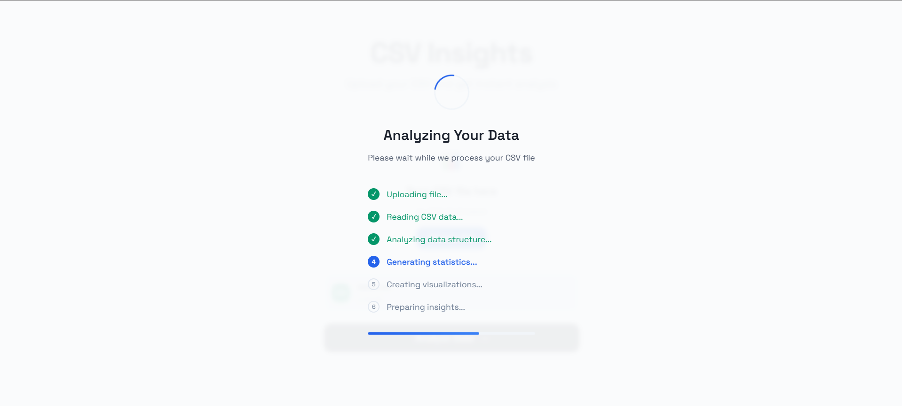
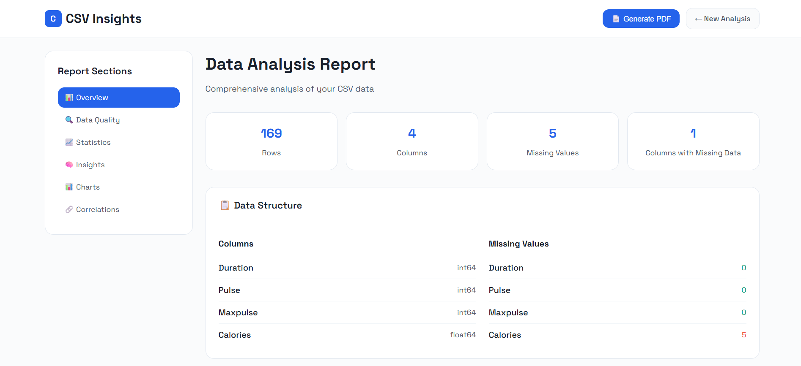
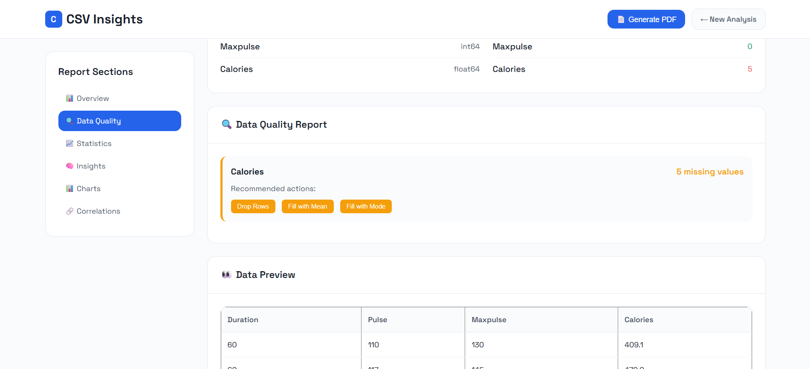
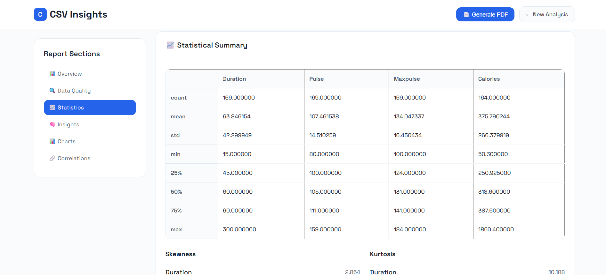
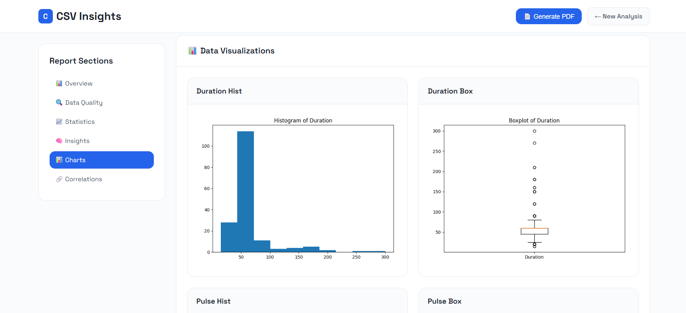
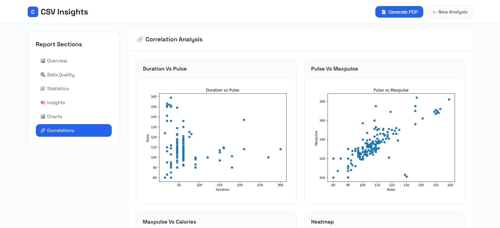
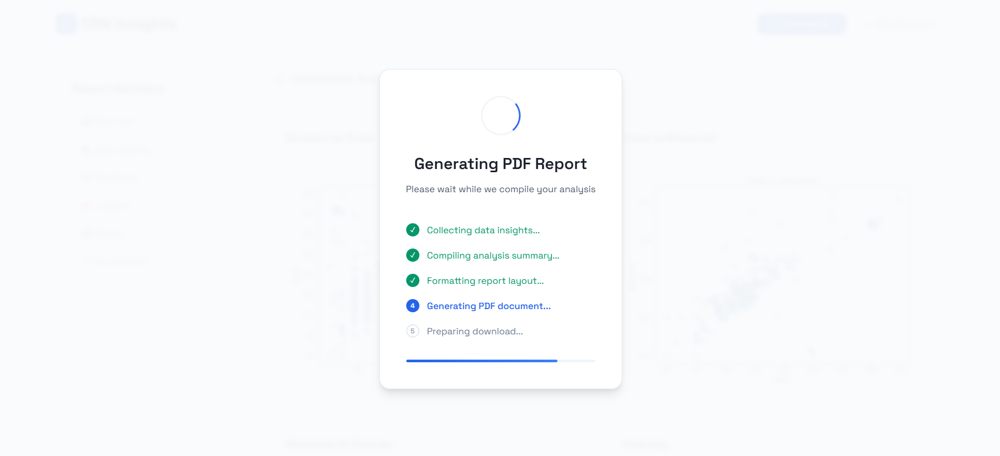

# 📊 Mini Exploratory Tool (Flask + Matplotlib)

A beginner-friendly Flask web app for performing **Exploratory Data Analysis (EDA)** on any uploaded CSV file. This tool automatically summarizes your dataset, generates visualizations, and allows you to **download a full EDA report in PDF** format.

---

## 🚀 Features

- Upload any CSV file and view:
  - Dataset shape and column info
  - Null value counts and missing data
  - Data types and type suggestions
  - Summary statistics (mean, std, min, etc.)
  - Skewness & kurtosis (distribution analysis)
  - Value counts for categorical features
- Automatically generated:
  - Univariate plots (bar, pie, histogram, boxplot)
  - Bivariate plots (scatter, correlation heatmap)
- 📄 Download a full **EDA Report (PDF)** including:
  - Summary
  - Warnings (missing values, skewness, outliers)
  - All generated plots

---

## 🧰 Tech Stack

- **Backend**: Flask
- **Plotting**: Matplotlib
- **PDF Generation**: FPDF
- **Session Storage**: Flask's built-in session

---

## 🛠️ Setup Instructions

1. **Clone the repository**  
   ```bash
   git clone https://github.com/Aswinchacko/https://github.com/Aswinchacko/Python-FLask-Web-App-for-Exploratory-Data-Analysis.git
   ```

2. **Create virtual environment (optional)**  
   ```bash
   python -m venv .venv
   source .venv/bin/activate     # Linux/Mac
   .venv\Scripts\activate      # Windows
   ```

3. **Install dependencies**  
   ```bash
   pip install -r requirements.txt
   ```

4. **Run the Flask app**  
   ```bash
   python app.py
   ```

5. **Visit in your browser**  
   ```
   http://127.0.0.1:5000/
   ```

---

## 📂 Folder Structure

```
.
├── app.py                    # Flask App
├── templates/
│   ├── index.html            # Upload page
│   └── eda.html              # EDA Results
├── static/
│   ├── eda_plots/            # Temporary folder for plots
│   └── final_eda_report.pdf  # Generated PDF report
├── uploads/                  # Uploaded CSV files
├── requirements.txt
└── README.md
```

---

## 📸 Screenshots

### Upload Interface


### EDA Analysis Results



### Visualizations



### PDF Report Generation



---

## ✍️ Author

Built with 💻 by Aswin Chacko
Feel free to contribute or suggest improvements!

---
